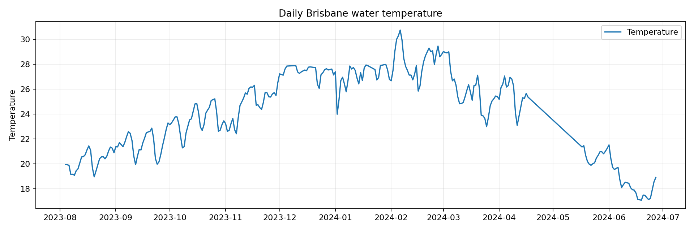
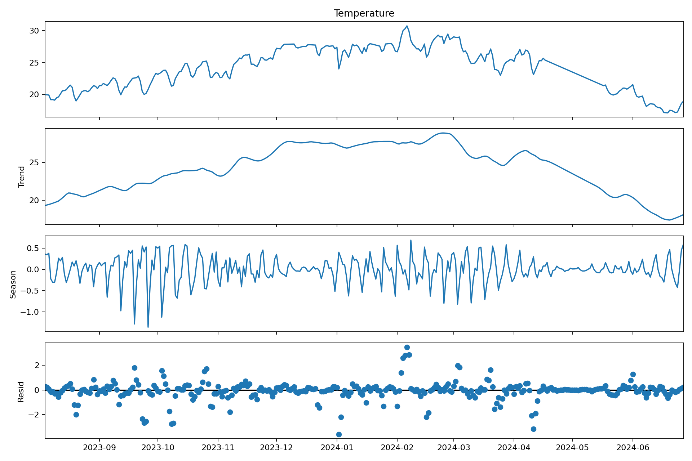
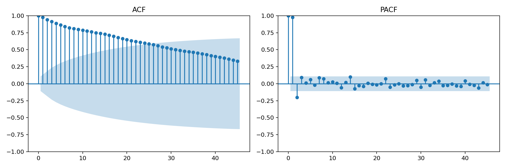
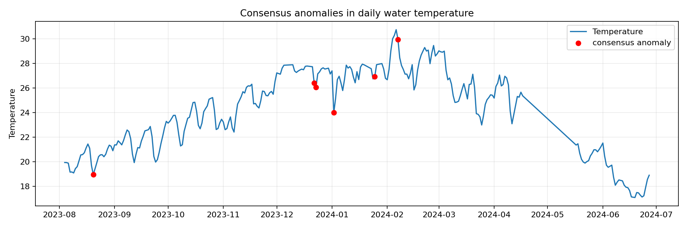
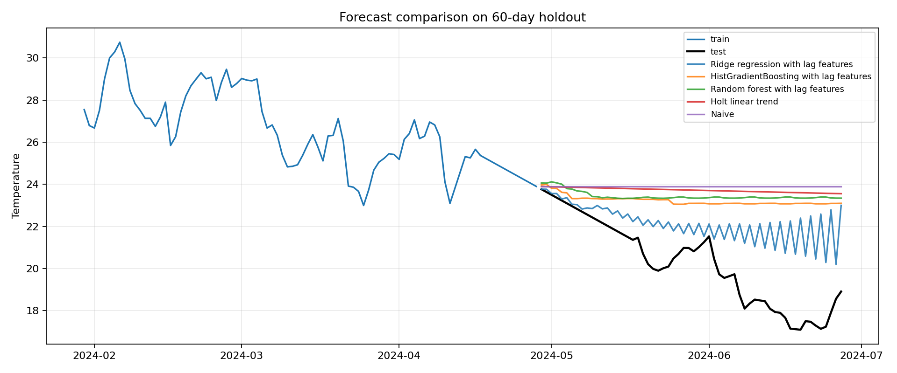

# Итоговое задание: анализ временного ряда качества воды

Данные: [Brisbane Water Quality Monitoring Dataset](https://github.com/MVRonkin/TimeSeriesCourse/tree/main/OLD%20Versions/2026/datasets/Water%20Quality%20Monitoring%20Dataset).  
Целевой временной ряд: дневная средняя температура воды `Temperature`.

## Постановка задачи

Задача исследования: построить воспроизводимый пайплайн прогнозирования дневной температуры воды по историческим значениям датчиков качества воды, сравнить статистические, ML и нейросетевые подходы, а также выделить аномальные дни.

Практическая постановка:

- тип задачи: offline-прогнозирование одномерного временного ряда;
- частота ряда: 1 день;
- горизонт прикладного прогноза: 14 дней;
- тестовая выборка для сравнения моделей: последние 60 дней;
- метрики: MAE, RMSE, sMAPE, MASE с недельным сезонным масштабом;
- целевая модель пайплайна: модель с минимальным MASE и устойчивыми ошибками на holdout.

## Данные и подготовка

Исходный файл `data/raw/brisbane_water_quality.csv` содержит 30 894 наблюдения за период с 2023-08-04 по 2024-06-27. В данных есть 280 повторяющихся временных меток, поэтому измерения сначала усредняются по `Timestamp`, затем ресемплируются до дневной частоты.

Использованные шаги подготовки:

- удалены служебные quality-колонки из набора признаков;
- числовые измерения приведены к `float`;
- дубликаты временных меток агрегированы средним;
- ряд приведен к регулярной дневной частоте;
- пропуски заполнены временной интерполяцией, затем `ffill/bfill`;
- подготовленный датасет сохранен в `data/processed/brisbane_temperature_daily.csv`.

Итоговый дневной ряд содержит 329 наблюдений без пропусков. Температура воды меняется от 17.10 до 30.75, среднее значение 24.09. Наиболее сильные связи с температурой у `pH` (-0.684), `Dissolved Oxygen` (-0.665), `Dissolved Oxygen (%Saturation)` (0.277) и `Average Water Speed` (0.226). В прогнозном пайплайне эти признаки не используются как будущие экзогенные переменные, потому что их будущие значения неизвестны; модели строятся на лагах, rolling-признаках и календарных признаках целевого ряда.

## EDA временного ряда



Ряд имеет выраженный сезонный тренд внутри доступного периода: температура растет от августа к летнему сезону Южного полушария, затем снижается к июню. Из-за короткой истории годовая сезонность оценивается ограниченно, поэтому для автоматизированного сравнения используется недельный сезонный масштаб.



STL-декомпозиция показывает сильную трендовую компоненту и умеренную краткосрочную волатильность. Тест Дики-Фуллера для исходного ряда не отвергает нестационарность: p-value = 0.899. Для первой разности p-value = 8.56e-07, поэтому статистические модели с дифференцированием и модели на лаговых признаках обоснованы.



ACF/PACF подтверждают высокую автокорреляцию соседних дней. Поэтому в ML/DL-моделях использованы лаги 1, 2, 3, 7, 14, 21, 28, rolling mean/std за 3, 7, 14 дней и календарные признаки.

## Поиск аномалий

Использованы три независимых метода:

- `STL robust z-score`: выбросы в остатках STL при robust z-score > 3.5;
- `Rolling IQR`: выход за локальные границы IQR на 14-дневном окне;
- `IsolationForest`: аномалии в пространстве лаговых и rolling-признаков.

Консенсусная аномалия определяется как день, отмеченный минимум двумя методами. Найдено 6 консенсусных аномалий: 2023-08-20, 2023-12-22, 2023-12-23, 2024-01-02, 2024-01-25, 2024-02-07.



Подробные результаты сохранены в `reports/anomaly_details.csv`, сводка по методам — в `reports/anomaly_summary.csv`.

## Сравнение моделей

Все модели обучались на первых 269 днях и оценивались на последних 60 днях. Таблица отсортирована по MASE.

| Семейство | Модель | MAE | RMSE | sMAPE, % | MASE | Комментарий |
|---|---:|---:|---:|---:|---:|---|
| ML | Ridge regression with lag features | 1.925 | 2.468 | 9.493 | 1.482 | Лаги, rolling-признаки и календарные признаки; L2-регуляризация |
| ML | HistGradientBoosting with lag features | 3.004 | 3.533 | 14.284 | 2.312 | Градиентный бустинг по лаговым признакам |
| ML | Random forest with lag features | 3.224 | 3.739 | 15.219 | 2.482 | Нелинейная модель на лаговых и календарных признаках |
| statistical | Holt linear trend | 3.498 | 3.993 | 16.377 | 2.693 | Линейный тренд без сезонной компоненты |
| baseline/statistical | Naive | 3.674 | 4.192 | 17.102 | 2.828 | Последнее наблюдение переносится на весь горизонт |
| statistical | Simple exponential smoothing | 3.674 | 4.192 | 17.102 | 2.828 | Автоподбор параметра сглаживания через statsmodels |
| ML | ExtraTrees with lag features | 3.700 | 4.200 | 17.212 | 2.848 | Ансамбль randomized trees для устойчивости на малой истории |
| statistical | SARIMAX (1,1,1)x(1,0,1,7) | 3.733 | 4.245 | 17.347 | 2.874 | Ручная SARIMA-спецификация для тренда и недельной структуры |
| statistical | Moving average, window 7 | 4.074 | 4.547 | 18.747 | 3.137 | Сглаженный локальный уровень за последнюю неделю |
| baseline/statistical | Seasonal naive, lag 7 | 4.088 | 4.564 | 18.795 | 3.147 | Недельный сезонный бейзлайн |
| statistical | Auto SARIMAX (2,1,1)x(1,0,0,7) | 4.118 | 4.592 | 18.926 | 3.171 | Мини-grid search по AIC, лучший AIC=485.03 |
| statistical | Theta | 4.149 | 4.704 | 19.037 | 3.194 | ThetaModel с недельной сезонностью |
| statistical | ETS additive trend + weekly seasonality | 4.239 | 4.810 | 19.400 | 3.264 | ETS(A,A,A) с недельной сезонностью |
| statistical | Day-of-week mean | 4.723 | 5.137 | 21.348 | 3.636 | Средняя температура по дню недели на обучающей истории |
| DL | MLP shallow (32) | 6.699 | 8.298 | 27.922 | 5.157 | Однослойная нейросеть по лаговым признакам |
| DL | MLP deep regularized (64,32,16) | 10.253 | 11.169 | 40.196 | 7.893 | Более глубокая MLP с усиленной L2-регуляризацией |
| DL | MLP deep (64,32) | 10.673 | 11.449 | 41.624 | 8.217 | Двухслойная MLP как data-driven DL-бейзлайн |

Полная машинно-читаемая таблица сохранена в `reports/model_comparison.csv`, прогнозы по holdout — в `reports/forecast_predictions.csv`.



Лучшей моделью стала `Ridge regression with lag features`: MAE = 1.925, RMSE = 2.468, sMAPE = 9.49%, MASE = 1.482. На короткой истории линейная регуляризованная модель оказалась устойчивее сложных ансамблей и MLP: она лучше переносит рекурсивное прогнозирование и меньше переобучается на локальные колебания. Нейросетевые модели показали худший результат из-за малого объема истории; для надежного DL-подхода нужен более длинный ряд или глобальная модель по нескольким связанным станциям.

## Пайплайн

Основной код находится в `src/time_series_pipeline.py`. Он выполняет полный цикл:

1. загрузка и подготовка исходного CSV;
2. сохранение дневного ряда;
3. EDA-графики: ряд, STL, ACF/PACF;
4. обучение baseline, статистических, ML и MLP-моделей;
5. расчет MAE, RMSE, sMAPE, MASE;
6. поиск аномалий тремя методами;
7. статистическая диагностика ADF и Ljung-Box;
8. сохранение `reports/*.csv`, `reports/*.json` и `reports/figures/*.png`.

Запуск:

```bash
python -m src.time_series_pipeline
```

Для локального окружения:

```bash
python -m venv .venv
source .venv/bin/activate
pip install -r requirements.txt
python -m src.time_series_pipeline
```

## Тестирование пайплайна

Статистическая проверка:

- ADF для исходного ряда: p-value = 0.899, ряд нестационарен;
- ADF для первой разности: p-value = 8.56e-07, первая разность стационарна;
- Ljung-Box для ошибок лучшей модели на лагах 7 и 14 имеет p-value < 0.001, поэтому в остатках остается автокорреляция. Это ограничение фиксируется как направление улучшения: добавить внешние погодные признаки, tide/seasonal covariates или использовать rolling-origin подбор параметров.

Производительность:

- полный прогон пайплайна на 30 894 исходных строках занял 7.42 секунды;
- обучено и сравнено 17 моделей;
- все артефакты пересоздаются одной командой без ручных шагов.

## Вывод

Для текущего набора данных выбран пайплайн на основе `Ridge regression with lag features`. Он дает лучший баланс точности, интерпретируемости и устойчивости на коротком временном ряду. Статистические модели полезны как прозрачные бейзлайны, но хуже отслеживают изменение тренда на holdout. MLP-модели в этой постановке не рекомендуются как основной вариант из-за малого объема данных и нестабильности рекурсивного прогноза.

Ключевые файлы результата:

- `notebooks/water_quality_timeseries.ipynb` — Jupyter notebook с кодом и комментариями;
- `src/time_series_pipeline.py` — воспроизводимый пайплайн;
- `data/processed/brisbane_temperature_daily.csv` — подготовленный дневной ряд;
- `reports/model_comparison.csv` — сравнение моделей;
- `reports/anomaly_details.csv` — детализация аномалий;
- `reports/summary.json` — машинно-читаемая сводка эксперимента.
